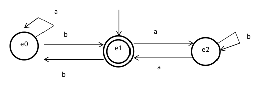

# Finite automata generator

## Description

The finite automata generator is a tool to facilitate the creation of a C state machine code with state matrix or state diagram.

## Menu

What is the file name ?: NameFile.c 

Number of symbols?: Number of transitions symbols(Only integer)

What is the symbol 0 ? : Symbol(Only character)

What is the symbol 1 ? :Symbol(Only character)

Number of states ? : Total number of states(Only integer)

What is the initial state ? : The initial state can only exist for one.(Only Integer)

Number of final states ? : The number of final states, there can be more than one.(Only Integer)
What is the final state 0 ? : what are the final state, state 1 etc (Only integer)

Hit, 1-for (function)   or   2-for (goto):1
You can choose whether your code will be generated with the function structure or Goto structure.(Only integer)

Insert -1 if the transition does not exist !

For state (0) and o symbol (a). What is the next state ? : It will insert the next state depending on the symbol of the transition (Only integer)

For state (0) and o symbol (b). What is the next state ? : It will insert the next state depending on the symbol of the transition (Only integer)

For state (1) and o symbol (a). What is the next state ? : It will insert the next state depending on the symbol of the transition (Only integer)

For state (1) and o symbol (b). What is the next state ? : It will insert the next state depending on the symbol of the transition (Only integer)

### The code will be generated.

## The diagram of finite automata.
 
 

## State table and transitions.

| |a|b|
|-|-|-|
|E0|E0|E1|
|E1|E2|E0|
|E2|E1|E2|

### The program challenge_goto.c was created with this tool and represents the diagram above.

